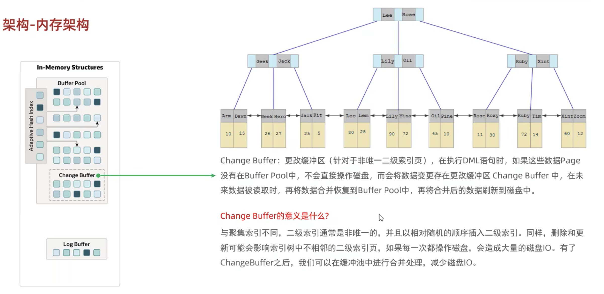

# Mysql_db_practice


## DDL-数据库操作

**创建数据库**

```
create database db_name;
create database if not exists db_name;
```

**切换数据库**

```
use db_name;
```

**查看当前数据库**

```
select database();
```

**删除数据库**

```
drop database if exist db_name;
```


## DDL-表操作

**查询当前数据库的所有表**

```
show tables;
```


**查询表结构**

```
desc tables_name;
```


**创建表**

```mysql
create table table_name (
	字段1 字段1类型[comment 字段1注释],
	字段2 字段2类型[comment 字段2注释],
)
```


```mysql
mysql> create table tb_user(
    -> id int comment '编号',
    -> name varchar(50) comment '姓名',
    -> age int comment '年龄',
    -> gender varchar(1) comment '性别'
    -> ) comment '用户表';
Query OK, 0 rows affected (0.03 sec)
```


**查看表**

```mysql
mysql> show create table tb_user;
+---------+------------------------------------------------------------------------------------------------------------------------------------------------------------------------------------------------------------------------------------------------------------------------------------------+
| Table   | Create Table                                                                                                                                                                                                                                                                             |
+---------+------------------------------------------------------------------------------------------------------------------------------------------------------------------------------------------------------------------------------------------------------------------------------------------+
| tb_user | CREATE TABLE `tb_user` (
  `id` int(11) DEFAULT NULL COMMENT '编号',
  `name` varchar(50) DEFAULT NULL COMMENT '姓名',
  `age` int(11) DEFAULT NULL COMMENT '年龄',
  `gender` varchar(1) DEFAULT NULL COMMENT '性别'
) ENGINE=InnoDB DEFAULT CHARSET=latin1 COMMENT='用户表'            |
+---------+------------------------------------------------------------------------------------------------------------------------------------------------------------------------------------------------------------------------------------------------------------------------------------------+
1 row in set (0.00 sec)
```


**添加字段**

```mysql
mysql> alter table tb_user add nickname varchar(20) comment '昵称';
Query OK, 0 rows affected (0.05 sec)
Records: 0  Duplicates: 0  Warnings: 0
```


**修改数据类型**

```mysql
alter table table_name modify 字段名 新数据类型（长度）
```


**修改字段名和字段类型**

```mysql
alter table 表名 change 旧字段名 新字段名 类型（长度）
```


**删除字段**

```mysql
alter table 表名 drop 字段名;
```


**修改表名**

```mysql
alter table 表名 rename to 新表名
```


**删除表**

```
dorp table [if exists] 表名;
```


**删除表并且重新创建该表**

```mysql
truncate table 表名;
```


## DML-Data Manipulation Language 


## 存储引擎

存储引擎是基于表的，不是基于库的，所以不同的表可以基于不同的引擎


**在表上选择存储引擎**

```mysql
create table 表名 my_myisam(
	id int,
	name varchar(10)
) engine = MyISAM;
```


## InnodDB和MyISAM的三大区别

事务、外键、行级锁


## 索引-语法

**创建索引**

```mysql
# 常规索引
create index 索引名 on 表名（字段名）

# 唯一索引
create unique index 索引名 on 表名(字段名)

# 联合索引，字段的顺序是有讲究的的，不能随便换顺序
create index 索引名 on 表名（字段名1，字段名2……）
```


**查看一个表的所有索引**

```mysql
show index from 表名
```


**删除索引**

```mysql
drop index 索引名 on 表名
```


## 索引-性能分析

**查看执行频次**

show [session|global] status 命令可以提供服务器状态信息。

```mysql
# 可以查看到insert，update，delete，select的访问频次
show global status like 'Com__'            # (7个下划线)

mysql> show global status like 'Com_______';
+---------------+-------+
| Variable_name | Value |
+---------------+-------+
| Com_binlog    | 0     |
| Com_commit    | 0     |
| Com_delete    | 1     |
| Com_insert    | 0     |
| Com_repair    | 0     |
| Com_revoke    | 0     |
| Com_select    | 14    |
| Com_signal    | 0     |
| Com_update    | 0     |
| Com_xa_end    | 0     |
+---------------+-------+
10 rows in set (0.01 sec)
```

比如执行一次“select * from 表名”，Com_select的值就会增加一。

可以用这个语句看到这个数据库当前哪种操作最多，来进行优化操作。


**慢查询日志**

慢查询日志记录了所有执行时间超过参数（long_query_time，单位：秒，默认10秒）的所有SQL语句的日志。

MySQL的慢查询日志默认没有开启，可以在MySQL的配置文件中（/etc/my.cnf）中配置如下信息：

```mysql
# 开启MySQL慢日志查询开关
slow_query_log=1
# SQL语句执行超过2秒的都会被记录
long_query_time=2
```


**show profiles**

show profiles 能够在做SQL优化的时候帮助我们了解时间都耗费到哪里去了。

使用以下语句可以看到当前MySQL是否支持profile操作：

```mysql
select @@have_profiling;

mysql> select @@have_profiling;
+------------------+
| @@have_profiling |
+------------------+
| YES              |
+------------------+
1 row in set, 1 warning (0.00 sec)
```


默认profiling是关闭的，可以通过set语句在session/global级别开启profiling：

```mysql
select @@profiling;

mysql> select @@profiling;
+-------------+
| @@profiling |
+-------------+
|           0 |
+-------------+
1 row in set, 1 warning (0.00 sec)

```


profile 详情

```mysql
# 查看每一条SQL的耗时情况
show profiles;

# 查看指定query_id的SQL语句各个阶段的耗时情况
show profile for query query_id;

# 查看指定query_id的SQL语句CPU的使用情况
show profile cpu for query query_id;
```


show profiles;


show profile for query query_id;


## Explain

explain1 语句1


explain2 语句2


explain执行计划各字段的含义：

**id**：select查询到序列号，表示查询中执行select子句或者是表的顺序， id越大越先执行，id一样的时候从上到下执行

select_type：表示select的类型，常见的取值有SIMPLE（简单表，不用表连接或者子查询）、PRIMARY（主查询，即外层查询）、UNION（UNION中的第二个或者后面的查询语句）、SUBQUERY（SELECT/WHERE之后包含了子查询）等

**type**：表示连接类型，性能由好到差的连接类型为NULL、system、const、eq_ref、ref、range、index、all。不查询任何表的时候才会到NULL，system是查询系统表的时候，访问主键或者唯一索引的时候是const，非唯一索引的时候会出现ref，all代表全表扫描，index代表对索引进行全部扫描。

**possible_key**：显示可能应用在这个表上的索引，一个或者多个。

**key**：实际使用的索引，如果为NULL，则表示没有使用索引。

**key_len**：索引中使用的字节数，该值为索引字段最大可能长度，并非实际使用长度，在不损失精确性的前提下，长度越短越好。

**filtered**：表示返回结果的行数占需要读取行数的百分比，filtered的值越大越好。

**Extra**：额外信息展示字段。


## 索引失效

**最左前缀法则**

如果索引了多列（联合索引），要遵循最左前缀法则。最左前缀法则指的是查询从索引的最左列开始，并且不跳过索引中的列。

如果跳跃了其中的一个字段，索引将会部分失效（后面字段的索引会失效）；

在where中字段顺序没有关系，只要存在就可以；

```
create index 索引名 on 表名（字段1，字段2，字段3）
select * from 表名 where 字段1=‘值1’ and 字段2='值2' # 索引不会失效
select * from 表名 where 字段1=‘值1’ and 字段3='值3' # 走字段1索引，字段3失效
select * from 表名 where 字段2='值2' and 字段3='值3' # 全索引会失效
```


**范围查询**

联合索引中，出现范围查询（>，<）范围查询右侧的列索引失效

解决方法，可以使用(>=, <=)代替（>, <）

```
select * from 表名 where 字段1='值1' and 字段2 > '值2' and 字段3 = '值3'  # 字段3的索引会失效
select * from 表名 where 字段1='值1' and 字段2 >= '值2' and 字段3 = '值3'  # 全字段索引都生效
```


**索引列运算**

在索引列上进行运算操作，索引会失效

```
explain select * from tb_user where substring(phone,10,2)='15'
```


**字符串不加引号，索引失效**

```
select * from tb_user where phone=153243232 # phone字段索引失效
select * from tb_user where phone='153243232' # phone字段索引不会失效
```


**模糊查询**

如果是尾部模糊查询，索引不会失效。如果是头部模糊查询，索引会失效

```
select * from tb_user where profession like '软件%'; # 索引不会失效
select * from tb_user where profession like '%工程'; # 索引会失效
select * from tb_user where profession like '%工'; # 索引会失效
```


**or连接的条件**

用or分割开的条件，如果or前的条件中的列有索引，而后面的列中没有索引，那么涉及的索引都不会被用到。

```mysql
# 前提条件：id是主键有索引，age没有索引

# 以下索引都会失效
select * from tb_user where id = 10 or age = 23;
select * from tb_user where phone = '17219219312' or age = 23;
```


**数据分布影响**

如果数据库认为走总表比走索引还快，则不会走索引


**SQL提示**

use index:建议使用哪个索引，mysql使不使用自己决定

```
explain select * from tb_user use index(idx_user_pro) where profession='软件工程';
```

ignore index: 不使用哪个索引

```
explain select * from tb_user ignore index(idx_user_pro) where profession='软件工程';
```

force index:强制使用哪个索引

```
explain select * from tb_user force index(idx_user_pro) where profession='软件工程';
```


## 覆盖索引&回表查询

所查询的字段，在这个索引中都有，就叫覆盖索引。

比如一个表中有字段1、字段2、字段3，但是select 字段1、字段2、字段3、字段4，在这个表中找不到字段4，这个时候就会产生回表查询。


select id, username,password from tb_user where username='itcast';

如何建立索引，使用username和password建立联合索引


## insert 优化

**批量插入**

```mysql
insert into tb_test values(1, 'Tom'), (2, 'Cat'), (3, 'Jerry')
```

**手动提交事务**

```mysql
start transaction
insert into tb_test values(1, 'Tom'), (2, 'Cat'), (3, 'Jerry')
insert into tb_test values(1, 'Tom'), (2, 'Cat'), (3, 'Jerry')
insert into tb_test values(1, 'Tom'), (2, 'Cat'), (3, 'Jerry')
commit;
```

**主键顺序插入**

1 2 3 5 7 99 101


**大批量插入数据**

可以只用load指令进行插入，需要执行以下3步

```mysql
# 客户端连接服务端时，加上参数--local-file
mysql --local-infile -u root -p
# 设置全局参数local_infile为1，开启从本地加载文件导入数据的开关
set global local_infile=1;
# 执行load指令将准备好的数据，加载到表结构中
load data local infile '/root/load_user_100w_sort.sql' into table 'tb_user' fileds terminated by ',' lines terminated by '\n';

# 本来应该10多分钟，使用load之后大概只需要十几秒
```


## 主键优化


**页分裂**

页可以为空，也可以填充一半，页可以填充100%。每个页包含2-N行数据（如果一行数据过大，会行溢出），根据主键排列。


主键乱序插入到时候会造成页分裂：会经历下面三个步骤

1. 当需要插入50的时候会发现页满了，存不下50了，需要分页，但是要在2#page前面，所以1#page会分成两部分；
2. 然后分出来的3#page需要在2#page前面，1#和2#的双指针就要断开，1#和3#进行连接，再2#和3#进行连接


**页合并**

当删除一行记录的时候，实际上记录并没有被物理删除，只是记录被标记为删除并且它的空间变得允许被其他记录声明使用。

当页中删除的记录达到MERGE_THRESHOLD（默认为页的50%），InnoDB会开始寻找最靠近的页（前或后）看看是否可以将两个页合并以优化空间使用。

MERGE_THRESHOLD可以在创建表或者索引的时候进行设置。


**主键设计原则**

1. 满足业务需求的情况下，尽量降低主键的长度；
   1. 因为二级索引下面挂着的就是主键，所以如果主键长度很长的话，会导致索引占据大量的磁盘空间；
2. 插入数据时，尽量选择顺序插入，选择使用AUTO_INCREMENT自增主键；
3. 尽量不要使用UUID做主键或者是其他自然主键，如身份证号；
4. 业务操作时，避免对主键的修改；


## order by 优化

在explain 中的extra中的描述会有Using filesort和Using index。 

1. Using filesort：通过表的索引或全表扫描，读取满足条件的数据行，然后在排序缓冲区sort buffer中完成排序操作，所有不是通过索引直接返回排序结果的排序都叫FileSort排序。
2. Using index：通过有序索引顺序扫描直接返回有序数据，这种情况即为using index，不需要额外排序，操作效率高。

总结：

1. 根据排序字段建立合适的索引，多字段排序时，也遵循最左前缀法则；
2. 尽量使用覆盖索引（比如不要使用select *）
3. 多字段排序，一个升序一个降序，此时需要注意联合索引在创建时多规则；
4. 如果不可避免的出现filesort，大数据量排序时，可以适当增大排序缓冲区大小，sort_buffer_size(默认256k)。如果超过了缓冲区大小就会在磁盘中进行排序，效率比较低。


## group by优化

假如建立了 profession，age的索引

然后执行

select age, count(*) from tb_user where profession='软件工程' group by age;

这个也是满足最左前缀法则的。


## limit优化

一个常见的问题就是limit 2000000，10，此时需要mysql排序前2000010记录，仅仅返回2000000-2000010的记录，其他记录丢弃，查询排序的代价非常大。


优化思路：一般分页查询时，通过创建覆盖索引能够比较好地提高性能，可以通过覆盖索引加子查询的形式进行优化。


## Count优化

1. MyISAM引擎把一个表的总行数存放在了磁盘，因此执行count(*)的时候会直接返回这个数，效率很高；
2. InnoDB引擎就很麻烦，它执行count(*)的时候，需要把数据一行一行地从引擎里面读出来，然后累积计数；


优化思路：自己计数


**count的几种用法**

**count(主键)**

InnoDB引擎会遍历整张表，把每一行的主键id值都取出来，返回给服务层。服务层拿到主键后，直接按行进行累加（主键不可能为null）。

**count(字段)**

没有not null约束：InnoDB引擎会遍历整张表把每一行都字段值都取出来，返回给服务层，服务层判断是否为null，不为null，计数增加。

有not null约束：InnoDB引擎会遍历整张表把每一行都字段值都取出来，返回给服务层，直接按行进行累加。

**count(1)**

InnoDB引擎遍历整张表，但不取值。服务层对于返回的每一行，放一个数字“1”进去，直接按行进行累加。

**count(*)**

InnoDB引擎并不会把全部字段取出来，而是专门做了优化，不取值，服务层直接按行进行累加。


## Update优化

InnoDB的行锁是针对索引加的锁，不是针对记录加的锁，并且该索引不能失效，否则会从行锁升级为表锁，影响并发效率。


## 全局锁

对整个数据库实例加锁，使用的场景是全库的逻辑备份，对所有的表进行锁定，保证数据的完整性。

```mysql
# 加全局锁
flush tables with read lock;
# 备份
mysqldump -uroot -p1234 itcast > itcast.sql
# 解锁
unlock tables;
```

**加了全局锁之后只能查不能写。**


数据库加锁是一个比较重的操作，存在以下两个问题：

1. 如果在主库上备份，那么在备份期间都不能执行更新，业务基本上要停摆；
2. 如果在从库上备份，那么备份期间从库不能执行主库同步过来的binlog，会导致主从延迟；


在InnoDB引擎中，我们可以在备份时，加上参数 --single-transaction 参数来完成不加锁的一致性备份。底层原理用的是快照读。

```mysql
mysqldump --single-transaction -uroot -p1234 itcast > itcast.sql
```


## 表级锁

1. 表锁；
2. 元数据锁；
3. 意向锁；


**表锁**

1. 读锁；read lock
2. 写锁；write lock

**语法**：

1. 加锁：lock tables 表名 表1 表2 read(write)
2. 释放锁：unlock tables 或者 客户端断开链接


**意向锁**

诞生的原因：假如在执行DML的时候，加了行锁。如果现在要加表锁执行lock tables 表名 read（write），那么系统需要对每一行进行检查，查看这个行锁和表锁是否兼容，这样性能很低。意向锁的操作方法：现在可以在执行DML的时候先加行锁，然后再给表加意向锁。这时候如果再加表锁，只需要和意向锁判断是否兼容就可以。如果兼容就加表锁，如果不兼容就阻塞，直到意向锁释放，再加表锁。


1. 意向共享锁（IS）：由语句select…lock in share mode添加。和读锁兼容。

2. 意向排他锁（IX）：由语句insert，update，delete，select…for update添加。和读锁、写锁都不兼容。意向锁之间不会互斥。


可以通过以下语句查看行锁和意向锁及行锁的加锁情况：

```mysql
select object_schema, object_name, index_name, lock_type, lock_mode, lock_data from performance_schema.data_locks;
```

 lock_type 表示锁的类型，table是表锁，record是行锁。


## 行级锁

应用在InnoDB存储引擎中。

InnoDB的数据是基于索引组织的，行锁是通过对索引上的索引项加锁来实现的，而不是对记录加锁。行锁住要分为以下三类：

1. 行锁（Record Lock）：锁定单个行记录的锁，防止其他事务对此进行update和delete。在RC和RR隔离级别下支持。

2. 间隙锁（Gap Lock）：锁定索引记录间隙（不含该记录），确保索引间隙不变，防止其他事务在这个间隙进行insert，产生幻读，在RR隔离级别下支持。

   

​	其中6和12之间就是间隙，12和16之间也是间隙，但是间隙锁不包含6or12，12or16

3. 临键锁（Next-ket lock）：行锁和间隙锁组合，同时锁住数据，并锁住数据前面的间隙Gap。在RR隔离级别下支持。

   


**行锁**

InnoDB有以下两个类型的锁

1. 共享锁（S）：和其他共享锁兼容，不兼容排他锁；
2. 排他锁（X）：允许获取排他锁的事务更新数据，阻止其他事务获得相同数据集的共享锁和排他锁。排他锁和其他共享锁和排他锁互斥。


**间隙锁**

默认情况下，InnoDB在RR事务隔离级别运行，InnoDB使用next-key锁进行搜索和索引扫描，以防止幻读。

1. 索引上的等值查询（唯一索引），给不存在的记录加锁时，优化为间隙锁；
2. 索引上的等值查询（普通索引），向右遍历时最后一个值不满足查询需求时，next-lock退化为间隙锁；
3. 索引上的范围查询（唯一索引）-- 会访问到不满足条件的第一个值为止。


注意：间隙锁唯一的目的是防止其他事务插入间隙。间隙锁可以共存，一个事务采用的间隙锁不会阻止另一个事务在同一间隙上采用间隙锁。


## InnoDB逻辑存储结构


## InnoDB架构内存结构





## 架构-后台线程


## 事务原理-持久性

redo-log，记录的是事务提交时数据页的修改，是用来实现事务的持久性。是物理日志，即这个数据页里面的数据是什么样的。

该日志文件主要有两部分组成：redo logo buffer和redo logo file，前者在内存中，后者在磁盘中。

事务提交之后，数据会先写入内存结构的Redolog buffer，然后刷新到磁盘当中，持久化的保存。

Q：提交的时候不用redolog可以吗？

A：不可以，因为事务对数据的修改在磁盘中是随机位置的，对于磁盘大量随机位置的修改IO性能很低。但是对于日志文件写的方式是追加的，所以顺序磁盘IO这个性能相对来说会比较好一点。

脏页的数据刷新到磁盘之后，redolog就失去作用了，所以那两个文件是循环写的。


## 事务原理-原子性

undo log

回滚日志，用于记录数据被修改前的信息，两个作用：提供回滚和MVCC；

undo log记录的是逻辑日志，并且是相反的操作。可以理解为，事务delete，undo log就记录insert。当执行roll back时，就可以从undo log中的逻辑日志中读取到相应的内容并进行回滚；

undo log销毁：undo log在事务执行时产生，并不会在事务结束时销毁，因为还会用于MVCC；

undo log存储：undo log采用段的方式进行管理和记录，存在roll back segment回滚段中，内部包含1024个 undo log日志。


## MVCC

